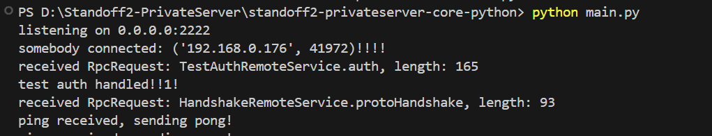

# standoff2-python-tcp-server-core
Standoff2 TCP Server
This project is a TCP server written in Python, using Google Protocol Buffers for data serialization.


# Requirements:
protobuf==6.30.0rc2

You can install the required version of Protocol Buffers using the following command:
```
pip install protobuf==6.30.0rc2
```


# Why game isn't loading?
Because it's core. You need implement all messages and logic by yourself. 


